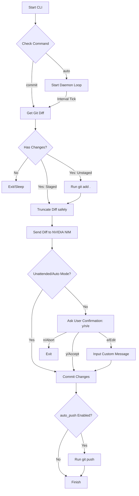

# 🔍 DiffSense

[](https://www.python.org/)
[](https://opensource.org/licenses/MIT)
[](https://conventionalcommits.org)

**DiffSense** is a developer productivity CLI tool that automates writing git commits using AI. By analyzing your local `git diff`, it understands code changes and generates semantic commit messages complying with the [Conventional Commits](https://www.conventionalcommits.org/) specification.

Powered by NVIDIA NIM API endpoints (running high-performance models like `meta/llama-3.1-8b-instruct`), DiffSense acts as your AI-powered git automation companion. Run it interactively or as a background auto-commit daemon to back up your changes.

---

## 🛠️ Features

*   **Smart Git Diff Analysis**: Captures staged changes. If none are staged, automatically stages unstaged changes before analysis.
*   **Hunk-Aware Diff Parsing**: Intelligently truncates large diffs up to your configured limit without cutting in the middle of diff hunk headers (`@@`).
*   **Conventional Commit Formatting**: Strict adherence to `<type>(<scope>): <summary>` format (e.g., `feat(auth): add login validation`).
*   **Interactive Mode**: Review proposed messages, accept, abort, or manually edit them inline.
*   **Auto-Commit Daemon**: An unattended background loop (`diffsense auto`) that periodically stages, generates commit messages, and pushes changes without requiring stdin.
*   **NVIDIA NIM API Integration**: Pre-configured to use fast LLM endpoints powered by NVIDIA APIs.

---

## 🏗️ Architecture Workflow

The diagram below illustrates how DiffSense processes your git changes:



---

## 🚀 Installation

### Prerequisites
*   Python **3.10 or higher**
*   Git installed and initialized in your target project directories

### 1. From Source
Clone the repository and install it in editable mode inside your virtual environment:
```bash
# From the root of the repository
pip install -e .
```

### 2. Using `uv` (Recommended)
If you use [uv](https://github.com/astral-sh/uv) (fast Python package manager), you can install the CLI tool globally:
```bash
uv tool install .
```
Verify the installation:
```bash
diffsense --help
```

---

## ⚙️ Configuration & Environment

### 1. API Key Setup
DiffSense relies on the NVIDIA API client. Get your API key from NVIDIA, then export it or set it in your environment:
```bash
export NVIDIA_API_KEY="your-nvidia-api-key"
```
Alternatively, create a `.env` file at the root of your project or within a `.diffsense` folder:
```env
# .env or .diffsense/.env
NVIDIA_API_KEY="your-nvidia-api-key"
```

### 2. YAML Configuration
Customize the settings globally or locally per project by creating a `.diffsense/config.yaml` file:

```yaml
# .diffsense/config.yaml

# Model identifier from NVIDIA NIM (e.g. meta/llama-3.1-8b-instruct)
model: "meta/llama-3.1-8b-instruct"

# Maximum lines of diff text to parse and send to the LLM (default: 2000)
max_diff_lines: 2000

# Push changes automatically to remote after committing (default: true)
auto_push: true

# Skip prompt confirmation if true (default: false, overridden to true in 'auto' mode)
unattended: false
```

---

## 💻 Usage

### On-Demand Commits
Stage some changes (or leave them unstaged) and run:
```bash
diffsense commit
```
If you have unstaged changes, DiffSense automatically stages them, analyzes the diff, and shows the proposed commit message:
```text
Generated Commit Message:
--------------------------------------------------
feat(cli): add interactive edit flow
--------------------------------------------------

Do you want to proceed with this commit? [Y/n/e(dit)]: 
```
*   Press **`Enter`** (or `y`) to accept and commit.
*   Type **`e`** to edit the message before confirming.
*   Type **`n`** to abort.

### Background Auto-Commit Daemon
To run DiffSense in a background tracking loop, run:
```bash
diffsense auto
```
You will be prompted to enter the interval duration:
```text
Time between each commit (in minutes, default 1): 2
Starting Auto-Commit Daemon (every 2.0 minute(s))...
```
The daemon runs unattended: it monitors for files changing, automatically stages them, generates messages, commits, and pushes them safely. You can stop the daemon at any time using `Ctrl+C`.

---

## 🛠️ Troubleshooting

### Command Not Found: pip
If `pip` is missing or you get permissions errors during installation, use `python -m pip install -e .` or install via **`uv`** as described in the installation section.

### Environment Variable Overrides
Make sure that your `.env` or `.diffsense/.env` file is in the current working directory from which you are running `diffsense`.
